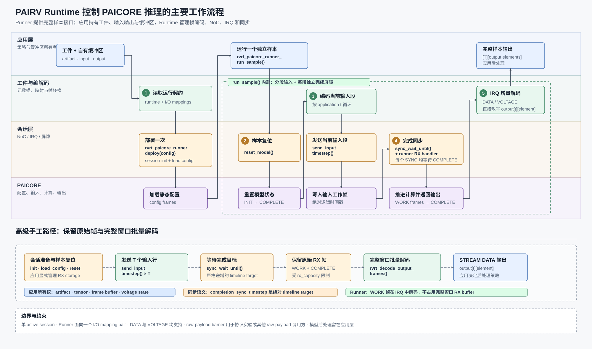

# PAIRV Runtime 手动推理 API 指南

本目录提供 PAICORE bare-metal 推理所需的基础运行时 API。它负责读取 PAIBox
导出的 artifact、把输入 tensor 编码为 NoC work frame、驱动 PAICORE 同步，以及
将接收帧还原为输出 tensor。

本文面向希望自己控制推理流程的应用。应用显式持有 artifact、输入、输出和帧缓冲，
按自己的时序发送输入并决定分类、检测、投票等业务后处理。本指南不讨论自动执行
计划或 CPU task 调度。

可参考完整的最小应用：
[`application/runtime/mnist`](../../application/runtime/mnist)。它展示了 8 个应用
timestep 的输入发送、一次同步、全窗口 DATA 输出解码，以及与软件 oracle 的比较。

## 1. 模块与术语

| 模块 | 职责 | 应用通常使用的接口 |
| --- | --- | --- |
| `artifact_reader.*` | 验证 FlatBuffers artifact 并借出 runtime、输入 mapping、输出 mapping | `rvrt_artifact_read()`、`rvrt_artifact_thread_runtime()` |
| `frame_codec.*` | 构造/识别逻辑帧，编码输入、解码 DATA 或 VOLTAGE 输出 | `rvrt_decode_output_frames()` |
| `session.*` | 加载配置帧、通过 NoC 收发、等待 PAICORE 完成帧 | `rvrt_session_load_config()`、`rvrt_session_sync_wait()` |
| `session_io.*` | 将 cursor、分块编码和发送循环封装为一个输入 timestep 操作 | `rvrt_session_send_input_timestep()` |

几个核心术语：

- **artifact**：PAIBox 导出的 `compile_artifacts.bin`。它包含配置帧、thread runtime
  参数和 I/O mapping。运行时只借用它的 backing bytes，不复制内容。
- **thread**：artifact 内一条 PAICORE 推理通路。一个 session 绑定一个 thread。
- **mapping**：逻辑 tensor 元素与 PAICORE frame 地址的对应关系。输入 mapping 用于
  编码，输出 mapping 用于解码。
- **应用 timestep**：应用对输入序列编号的 `0..timesteps-1`。应用无需计算网络层数、
  流水线深度或 PAICORE 的内部推进过程。
- **RX frames**：一次同步期间从 NoC 接收到的原始帧序列，包含 DATA、VOLTAGE、
  complete 等协议帧。

### 工作流程图

下图展示手动 runtime API 的整体控制链。图中“内部编码 chunk”和“内部发送
chunk”是 `rvrt_session_send_input_timestep()` 隐藏的实现步骤，普通应用不需要
直接维护 cursor。



图中主线对应后文的 artifact 读取、session 初始化、输入发送、同步和全窗口输出
解码；应用只负责提供 buffer 并执行模型特有的后处理。

典型调用链如下：

```text
artifact bytes
  -> artifact_reader: runtime + input/output mapping
  -> session: load_config
  -> session_io: send_input_timestep (重复 timesteps 次)
  -> session: sync_wait
  -> frame_codec: decode_output_frames
  -> application: 比较结果、spike sum、argmax 或其他业务处理
```

## 2. 构建与文件组织

手动应用按需编译 runtime 源文件，不会自动链接本目录的全部实现。最小 DATA 推理
通常需要：

```make
PAIRV_RUNTIME_DIR = $(NUCLEI_SDK_ROOT)/Lib/runtime

C_SRCS += $(PAIRV_RUNTIME_DIR)/frame_codec.c
C_SRCS += $(PAIRV_RUNTIME_DIR)/session.c
C_SRCS += $(PAIRV_RUNTIME_DIR)/session_io.c
CXX_SRCS += $(PAIRV_RUNTIME_DIR)/artifact_reader.cpp

INCDIRS += $(NUCLEI_SDK_ROOT)/Lib $(PAIRV_RUNTIME_DIR)
INCDIRS += $(NUCLEI_SDK_ROOT)/third_party/flatbuffers/include
```

`artifact_reader.cpp` 是 C++ 文件，但公共头文件同时兼容 C17 与 C++17；应用的
`main.c` 可以继续用 C 编写。

`Lib/build.mk` 会引入本目录的 `build.mk`，提供两个可覆盖参数：

```make
RVRT_MAX_WORKSPACE_FRAMES ?= 512
RVRT_SESSION_ENABLE_STATS ?= 0
```

```sh
make RVRT_MAX_WORKSPACE_FRAMES=64 RVRT_SESSION_ENABLE_STATS=1 ...
```

- `RVRT_MAX_WORKSPACE_FRAMES`是输入编码 workspace 的编译期上限，合法范围为
  `1..512`。每帧为 8 bytes，因此上限对应 4 KiB workspace。
- `RVRT_SESSION_ENABLE_STATS`只能为 `0` 或 `1`。开启后 session 累积收发帧数和
  同步等待周期，使用 `rvrt_session_get_stats()`读取。

所有编译单元必须使用相同的这两个宏值。应用仍自行选择实际 workspace 容量，只要
不超过 `RVRT_MAX_WORKSPACE_FRAMES`。

## 3. 调用前准备

应用负责提供以下存储，并在整个推理期间保持其有效：

| 存储 | 所有者 | 容量规则 |
| --- | --- | --- |
| artifact bytes | 应用 | 传给 `rvrt_artifact_read()`的地址需满足 artifact 对齐要求，且在所有 view/session 使用期间存活 |
| RX frame buffer | 应用 | `rvrt_session_config_t.rx_capacity` 个 `rvrt_frame_t`；必须覆盖一次同步可能收到的全部帧 |
| 输入 workspace | 应用 | `1..RVRT_MAX_WORKSPACE_FRAMES` 个 `rvrt_frame_t`；可在每个 chunk 间复用 |
| 输入 tensor | 应用 | 至少覆盖 input mapping 实际访问到的字节 |
| 输出 tensor | 应用 | STREAM DATA 全窗口解码至少为 `runtime.timesteps * output_view.element_count` bytes |

RX 容量没有针对手动应用的自动推导接口。模型输出规模、输入稀疏度、协议帧和板端
行为均会影响实际帧数，因此应用应基于自己的模型设置容量，并把
`RVRT_SESSION_OVERFLOW`当作需要增大 RX buffer 的错误处理。

当前 session 的 NoC IRQ 状态是单实例资源。同一时刻只初始化并使用一个 active
session；在同一应用内切换 artifact 或 thread 前，应先结束前一次推理流程。

## 4. 读取 artifact 与 mapping

以下代码展示最常见的单 thread、单输入、单输出 artifact。为突出数据流，示例将
错误处理压缩为直接返回；生产代码应根据对应的 status string 输出诊断信息。

```c
const uint8_t *artifact_data = /* 已嵌入或加载的 compile_artifacts.bin */;
const size_t artifact_size = /* artifact 字节数 */;
const uint32_t thread_index = 0U;
const uint32_t input_index = 0U;
const uint32_t output_index = 0U;

rvrt_artifact_t artifact = {0};
rvrt_artifact_runtime_t runtime = {0};
rvrt_artifact_input_mapping_view_t input_view = {0};
rvrt_artifact_output_mapping_view_t output_view = {0};

if (rvrt_artifact_read(artifact_data, artifact_size, &artifact) !=
    RVRT_ARTIFACT_OK) {
    return 1;
}
if (rvrt_artifact_thread_runtime(&artifact, thread_index, &runtime) !=
        RVRT_ARTIFACT_OK ||
    rvrt_artifact_get_input_mapping_view(&artifact, thread_index, input_index,
                                         &input_view) != RVRT_ARTIFACT_OK ||
    rvrt_artifact_get_output_mapping_view(&artifact, thread_index, output_index,
                                          &output_view) != RVRT_ARTIFACT_OK) {
    return 1;
}
```

`thread_index`、`input_index`和`output_index`都是 artifact 内局部索引。MNIST
示例使用 `0`，是因为它的 artifact 明确只有一条通路和一组 I/O mapping；多 thread
或多 I/O 的应用必须从自己的 artifact 契约中选择正确索引。可用
`rvrt_artifact_thread_count()`确认 thread 数量。

返回的 mapping view 是借用视图：不得释放、移动或覆盖 artifact backing bytes，也
不得把 view 用于另一个 artifact。

`runtime`中最常用的字段是：

| 字段 | 用途 |
| --- | --- |
| `timesteps` | 应用需要发送的输入 timestep 数，也是批量解码的第一维 |
| `sync_steps` | 传给 `rvrt_session_sync_wait()`的同步步数 |
| `decode_mode` | 批量 DATA 解码目前要求 `RVRT_DECODE_MODE_STREAM` |
| `tick_depth` | artifact 的流水线元数据；应用无需据此手工偏移输出时间步 |

`output_view.element_count`已由 artifact 输出 shape 验证，可直接用于分配输出数组。

### 更新 Artifact 协议

`compile_artifacts.fbs`的唯一来源是 PAIBox。应用不应直接包含 schema 或生成的
FlatBuffers 头；它们只通过本目录的公开 runtime API 消费 artifact。

当 PAIBox 的 artifact 契约改变时，按以下顺序更新：

1. 在 PAIBox 修改 schema/exporter，并用同一 schema 与 `flatc`重新生成
   `Lib/runtime/generated/compile_artifacts_generated.h`；生成文件不得手改。
2. 更新 `artifact_reader`的版本与字段验证、必要的 mapping view/codec 语义，以及
   `tests/runtime`。当前 reader 只接受它明确支持的 `schema_version`。
3. runtime 测试通过后，用匹配版本的 PAIBox 重新导出每个 demo 的
   `compile_artifacts.bin`。不要只替换二进制而保留旧 runtime。
4. 仅当模型 I/O shape、dtype、timestep 或输出语义变化时，才更新 demo 的输入数据、
   静态容量、oracle 和业务后处理；随后重新运行 host 测试并编译该 demo。

若 schema version 未变，且新增字段不影响当前 reader、mapping 或 frame 语义，已有
artifact 与 demo 无需为了 schema 文件本身而刷新。生成 binding 的来源与字段参考见
[`generated/README.md`](generated/README.md)。

## 5. 初始化 session 并加载配置

配置帧在输入之前加载。通常在设备复位后或切换 artifact 后加载一次；不应在每个
sample 前重复加载。

```c
static rvrt_frame_t rx_frames[APP_RX_FRAMES];

rvrt_session_t session = {0};
const rvrt_session_config_t config = {
    .artifact = &artifact,
    .thread_index = thread_index,
    .rx_frames = rx_frames,
    .rx_capacity = APP_RX_FRAMES,
};

if (rvrt_session_init(&session, &config) != RVRT_SESSION_OK ||
    rvrt_session_load_config(&session) != RVRT_SESSION_OK) {
    return 1;
}
```

`rvrt_session_init()`绑定 artifact/thread/RX storage 并注册 NoC IRQ。
`rvrt_session_load_config()`从 artifact 读取静态配置帧并写入 PAICORE。

需要区分三类状态码：

- `rvrt_artifact_status_t`：artifact 格式、字段和索引错误，使用
  `rvrt_artifact_status_string()`。
- `rvrt_status_t`：frame 编解码错误，使用 `rvrt_status_string()`。
- `rvrt_session_status_t`：NoC、超时、RX overflow 和硬件错误，使用
  `rvrt_session_status_string()`。

## 6. 发送应用 timestep 输入

推荐使用 `rvrt_session_send_input_timestep()`。它把 cursor 初始化、分块调用
`rvrt_encode_input_chunk()`和发送帧的循环收在 runtime 内；应用不需要关心一个
workspace 能装下多少 mapping entry。

```c
static rvrt_frame_t workspace[APP_WORKSPACE_FRAMES];

for (uint32_t timestep = 0U; timestep < runtime.timesteps; ++timestep) {
    const uint8_t *input_t = &input[timestep * input_bytes];
    if (rvrt_session_send_input_timestep(
            &session, &input_view, timestep, input_t, input_bytes, workspace,
            APP_WORKSPACE_FRAMES) != RVRT_SESSION_OK) {
        return 1;
    }
}
```

输入 tensor 的布局和 `input_bytes`由应用定义，但必须与 input mapping 一致。全零
输入也应调用该 helper：它会正常遍历 mapping，只是不产生 DATA work frame。

### 需要更底层控制时

只有在自定义传输、统计每个 chunk 或复用编码帧时，才直接使用：

```text
rvrt_input_cursor_init()
  -> rvrt_encode_input_chunk()
  -> rvrt_session_send_frames()
  -> 若返回 BUFFER_FULL 则继续
```

cursor 是一个可恢复位置，不是额外的模型配置。它让固定大小的 SRAM workspace 可以
完整编码任意长度的 input mapping。普通应用无需保存或配置它。

`rvrt_build_init_frame()`和`rvrt_build_sync_frame()`是 frame 级控制帧构造接口。
标准 session 流程已分别在配置加载和同步中处理它们；除非实现自定义传输层，否则
不应直接调用。

## 7. 同步并获取 RX frames

输入发完后，使用 artifact 的 `sync_steps`推进 PAICORE 并等待 complete frame：

```c
const rvrt_frame_t *received = NULL;
uint32_t received_count = 0U;

if (rvrt_session_sync_wait(&session, runtime.sync_steps, timeout_ms,
                           &received, &received_count) != RVRT_SESSION_OK) {
    return 1;
}
```

返回的 `received`借用 session 的 RX buffer，在下一次 `rvrt_session_sync_wait()`
前有效。调用方应把 `received_count`对应的**全部**帧交给批量 decoder；不需要也不应
按网络层数、`tick_depth`或 PAICORE 控制帧数自行裁剪。

`timeout_ms`是应用的等待策略。超时、FIFO overflow 或硬件错误后，session 会解除
armed 状态；应用可记录错误、重新加载配置，或根据产品策略复位外设。

## 8. 解码完整输出窗口

对于 STREAM DATA 输出，使用 `rvrt_decode_output_frames()`：

```c
const size_t output_size =
    (size_t)runtime.timesteps * output_view.element_count;
uint8_t output[APP_TIMESTEPS * APP_OUTPUT_ELEMENTS] = {0};

if (output_size > sizeof(output) ||
    rvrt_decode_output_frames(&output_view, &runtime, received, received_count,
                              output, sizeof(output)) != RVRT_STATUS_OK) {
    return 1;
}
```

输出布局固定为：

```text
output[application_timestep][element]
offset = application_timestep * output_view.element_count + element
```

decoder 在开始前清零完整输出区域，并自动忽略 complete、非 DATA work frame、未映射
地址和应用 timestep 范围外的 frame。因此未产生 spike 的元素保持为零，应用只需
处理已经归一化后的 `[0, timesteps)`时间维度。

当前 artifact ABI 中，frame timestamp 去除 `target_lcn`地址位后就是应用 timestep。
`tick_depth`和`sync_steps`由 runtime 校验其一致性，但不会暴露为应用侧的时间偏移
计算。单 timestep 模型自然得到 `[1][element_count]`，不需要另一套 API。

批量接口目前仅支持 `RVRT_DECODE_MODE_STREAM`和 `RVRT_OUTPUT_DATA`。它不做
spike sum、阈值、投票、argmax 或数据类型转换，这些都是模型/业务语义：

```c
for (uint32_t t = 0U; t < runtime.timesteps; ++t) {
    for (uint32_t e = 0U; e < output_view.element_count; ++e) {
        spike_sum[e] += output[t * output_view.element_count + e];
    }
}
```

### 单帧与 VOLTAGE 输出

- `rvrt_decode_output_frame()`保留为兼容接口，只写入 application timestep 0 的
  DATA frame。它适合只关心一个 frame 的调试，不适合多 timestep 推理结果。
- `rvrt_decode_voltage_frame()`用于一个 VOLTAGE work frame 的 32-bit 四 lane
  聚合。调用方提供每个输出元素一份 `rvrt_voltage_decode_state_t`；不同元素的 lane
  可以交错到达。当前没有 VOLTAGE 的全窗口聚合 helper。

## 9. 常见问题与排查

| 现象 | 首先检查 |
| --- | --- |
| `RVRT_SESSION_OVERFLOW` | 增大 RX frame buffer；不要只按输出 tensor 元素数估算帧数 |
| `RVRT_SESSION_TIMEOUT` | `runtime.sync_steps`是否直接传入、配置帧是否已加载、NoC/板端状态是否正常 |
| `RVRT_STATUS_OUT_OF_RANGE` | 输入字节数是否覆盖 mapping、输出容量是否为 `timesteps * element_count` |
| `RVRT_STATUS_UNSUPPORTED` | 批量接口当前只接受 STREAM DATA；检查 artifact 的 `decode_mode`和输出 kind |
| 解码全零 | 确认使用同一 thread 的 mapping 和 session，且输入 timestep 已全部发送后才同步 |
| artifact 读取失败 | artifact backing bytes 的大小、对齐、版本和存活期是否正确 |

若启用了统计，可在一次或多次同步后读取：

```c
rvrt_session_stats_t stats = {0};
if (rvrt_session_get_stats(&session, &stats) == RVRT_SESSION_OK) {
    /* stats.sent_frames、stats.rx_frames、stats.sync_wait_cycles 等 */
}
```

统计关闭时该函数仍可调用，但返回全零计数，便于应用保持同一诊断代码。

## 10. 最小检查清单

1. artifact backing bytes 在整个 session 生命周期内有效。
2. 选择同一 thread 的 runtime、input mapping、output mapping 和 session。
3. 先 `rvrt_session_load_config()`，再发送每个应用 timestep 输入。
4. 使用 artifact 的 `runtime.sync_steps`调用一次 `rvrt_session_sync_wait()`。
5. 将全部 RX frames 传给 `rvrt_decode_output_frames()`。
6. 按 `runtime.timesteps * output_view.element_count`提供输出空间。
7. 在应用侧实现模型特有的后处理与结果校验。

满足以上约束后，应用不需要理解 PAICORE 的内部流水线推进，也不需要手写 input
cursor、同步控制帧或多 timestep DATA 输出的 frame 地址解析。
