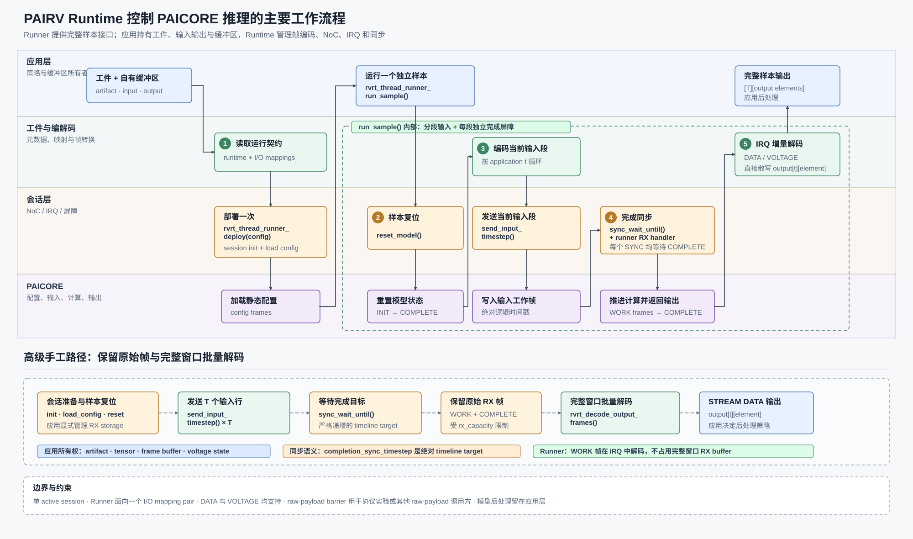

# PAIRV C Runtime

`Lib/runtime` 是 PAIRV 裸机应用使用 PAIBox `compile_artifacts.bin` 的运行时。它
验证 FlatBuffers artifact，读取线程和 mapping 元数据，编码输入 PAICORE frame，
通过 NoC/IRQ 发送和接收数据，并将 DATA 或 VOLTAGE 输出解码到应用提供的缓冲区。
应用仍负责 tensor 内存、预处理、后处理、模型顺序和业务错误呈现。

当前生产执行路径是：

```text
Artifact bytes
    -> RuntimeSession（物理传输、配置、IRQ 和故障所有者）
    -> ThreadRunner（一个 artifact thread + input/output mapping）
    -> sample input / per-timestep SYNC(1) / output decode
```



## 1. 架构与边界

### 模块职责

| 模块 | 负责 | 不负责 |
| --- | --- | --- |
| `artifact_reader` | FlatBuffers 校验、schema/version、thread、runtime、mapping 和 config view | 分配 tensor、访问 NoC、业务后处理 |
| `frame_codec` | logical frame、输入 cursor/chunk、DATA/VOLTAGE 编解码 | IRQ、硬件等待、模型调度 |
| `runtime_session` | 一个共享 session 的 artifact、全局 config、物理 owner、RX barrier、统计和 sticky fault | 线程时间线、tensor 业务语义 |
| `thread_runner` | 显式 thread/mapping 选择、INIT、输入步、SYNC、输出 decode 和本地进度 | OS 线程、应用级 scheduler、并行 IRQ |
| `transport_*_internal` | NoC/FIFO/IRQ 和 barrier 的内部 primitive | 应用 public API |
| application | storage、样本循环、模型后处理和结果呈现 | 重写 frame 位布局或同步协议 |

DATA/VOLTAGE 解码集中在 `frame_codec.c`。Runner open 时检查 mapping 是否满足直接地址
计算的布局，满足时每帧用 O(1) 查找；其余合法布局使用通用 decoder 的线性 mapping
查找。快路径不在 Runner 中维护第二份位布局逻辑。这里的复杂度差异不等于板卡实测加速比。

`RuntimeSession` 是物理资源所有者，不是 OS 线程。多个 `ThreadRunner` 可以绑定同一
session，但 Phase 1 只允许顺序执行，任何时刻只有一个 active runner 和一个 RX barrier。
这样可以隔离不同 artifact thread 的 root、mapping、timeline 和 output state，同时不引入
应用级调度器或并行 IRQ 协议。

### 生命周期

```text
rvrt_runtime_session_open()
  -> rvrt_runtime_session_configure()       // 全局 config 只提交一次
  -> rvrt_thread_runner_open()              // 选择 thread/mapping
  -> rvrt_thread_runner_run_sample()
  -> rvrt_thread_runner_close()
  -> rvrt_runtime_session_close()
```

`open` 只校验并借用 artifact、frame/RX storage，注册唯一 physical owner，不发送
config。`configure` 第一次调用发送 artifact 中的全部全局 config；后续调用幂等返回成功。
`runner_open` 缓存 thread runtime、root-relative mapping view、row bytes、completion
target 和可用的 fast-layout，不发送 INIT 或 SYNC。关闭顺序必须是 runner 在前、session
在后；仍有 runner 或 active barrier 时 session close 返回 `RVRT_RUNTIME_BUSY`。

### 故障与状态

`RVRT_RUNTIME_TIMEOUT`、`RVRT_RUNTIME_OVERFLOW`、`RVRT_RUNTIME_HARDWARE_ERROR` 和
RX handler failure 会把共享 session 置为 sticky `RVRT_RUNTIME_FAULTED`。之后新的硬件
操作立即失败，应用应完成 runner/session 清理并在硬件恢复后重新 open。输入容量、stride、
对齐、mapping 或 codec 参数错误只返回参数错误，不自动污染 session 状态。

`RVRT_RUNTIME_BUSY` 表示物理 owner、active runner 或 active barrier 已被占用；它不表示
PAICORE 计算完成。`RVRT_RUNTIME_SYNC_MODE_ERROR` 表示同一 reset epoch 混用了 raw payload
和 timeline barrier，必须重新 reset。统计是观察数据，不改变执行语义；关闭
`RVRT_ENABLE_STATS` 时仍保留稳定的统计结构，但 counter 为零且 `enabled=false`。

## 2. 如何使用

### 最小完整样本

下面的代码展示当前 API 的最短调用链。artifact、frame buffer、输入、输出和 VOLTAGE
state 均由调用者拥有，并且必须覆盖整个生命周期。

```c
#include "runtime_session.h"
#include "thread_runner.h"

static rvrt_frame_t rx_storage[128];
static rvrt_runtime_session_t session;
static rvrt_thread_runner_t runner;

int run_sample(const uint8_t *artifact, size_t artifact_size,
               const uint8_t *input, size_t input_bytes,
               uint8_t *output, size_t output_bytes)
{
    const rvrt_runtime_session_open_config_t session_cfg = {
        .artifact_data = artifact,
        .artifact_size = artifact_size,
        .frame_buffer = rx_storage,
        .frame_capacity = 128U,
    };
    rvrt_runtime_status_t status =
        rvrt_runtime_session_open(&session, &session_cfg);
    if (status != RVRT_RUNTIME_OK) {
        return (int)status;
    }

    status = rvrt_runtime_session_configure(&session);
    if (status != RVRT_RUNTIME_OK) {
        (void)rvrt_runtime_session_close(&session);
        return (int)status;
    }

    const rvrt_thread_runner_open_config_t runner_cfg = {
        .session = &session,
        .thread_index = 0U,
        .input_mapping_index = 0U,
        .output_mapping_index = 0U,
        .voltage_state = NULL,
        .voltage_state_capacity = 0U,
        .timeout_ms = 1000U,
    };
    status = rvrt_thread_runner_open(&runner, &runner_cfg);
    if (status == RVRT_RUNTIME_OK) {
        status = rvrt_thread_runner_run_sample(
            &runner, input, input_bytes, 0U, output, output_bytes, 0U);
        (void)rvrt_thread_runner_close(&runner);
    }
    const rvrt_runtime_status_t close_status =
        rvrt_runtime_session_close(&session);
    return (int)((status != RVRT_RUNTIME_OK) ? status : close_status);
}
```

`thread_index`、`input_mapping_index` 和 `output_mapping_index` 是 artifact 中的数字
索引；C runtime 不解析 mapping name。`input_stride` 或 `output_stride` 为零表示紧凑
连续行，否则以字节为单位。输入和输出区域不能非法重叠；VOLTAGE 输出还要求输出地址、
容量和 stride 满足 `int32_t` 对齐，并提供足够的 caller-owned `rvrt_voltage_decode_state_t`。

### 多 runner

同一 session 可依次绑定多个 runner：每个 runner 选择自己的 thread/root、mapping、
runtime schedule、local `sync_mode`、完成步数和 decode state。先关闭所有 runner，再关闭
session。共享 session 只复用 config、IRQ owner、RX storage 和 transport statistics，
不会把一个 runner 的时间线复制给另一个 runner。

### Profiling 与统计

需要每次 INIT/SYNC 往返周期时，调用
`rvrt_thread_runner_run_sample_profiled()`，并传入调用者分配的
`rvrt_thread_runner_sample_timing_t` 数组；数组容量必须覆盖每个输入 timestep 和可选的
一次 tail drain。`rvrt_thread_runner_get_stats()` 或
`rvrt_runtime_session_get_stats()` 返回共享 transport snapshot。统计路径不应在 IRQ handler
中加入日志、分配或 mapping 查询。

Profiling 的计时点直接位于 Runner 的 INIT/SYNC 操作旁，包含可选 tail drain。
当前不单独增加 profiling 模块：它没有独立执行职责，拆分只会增加转发接口；
以后若出现多个执行组件共用的统计导出或聚合逻辑，再整理公共部分。

## 3. 设计语义

### 输入、同步与输出时间

一次成功的 runner sample 会：

1. 用本 runner 的 thread root 发送 INIT 并等待 COMPLETE，建立硬件 reset epoch。
2. 对 `runtime.timesteps` 个应用 timestep 逐步编码并发送 input mapping。
3. 每次输入后执行独立的 timeline `SYNC(1)` barrier，收到 COMPLETE 后才提交下一步。
4. 对收到的 DATA/VOLTAGE frame 按 frame timestamp 散写到对应输出行。
5. 当 artifact 的 `completion_sync_timestep` 大于输入步数时，再执行一次最终 tail drain。

`runtime.timesteps` 是应用输入/输出行数；`pipeline_latency` 是流水线元数据；
`completion_sync_timestep` 是 artifact 给出的最终 PAICORE timeline target。它们不能被
应用重新推导，也不能把 SYNC payload 当成输出行号。逐步 SYNC 是正确性基线，不宣称
Phase 1 提供 `SYNC(N)` 吞吐优化。

输出 decoder 是通用的：缺失的 DATA 保持零，非 DATA、未映射或范围外 frame 被忽略或按
codec 状态返回错误；spike sum、vote、threshold、argmax 和 oracle 比较留在应用层。
VOLTAGE frame 按 lane 合并到 `int32_t` 输出，并使用 runner 自己的 voltage state。

### 所有权和容量

| 对象 | 所有者 | 生命周期/约束 |
| --- | --- | --- |
| artifact bytes | 应用 | `RVRT_ARTIFACT_ALIGNMENT` 对齐；直到 session close 前保持不动 |
| artifact/mapping view | runtime 借用 | 不复制、不释放，不能跨 artifact 使用 |
| frame/RX storage | 应用 | session open 到 close 期间保持有效；一次 barrier 复用 |
| input/output | 应用 | 容量、stride、对齐和 overlap 由 runner 校验 |
| VOLTAGE state | 应用 | 每个 runner 独立提供，首次 sample 前由 runtime 清零 |
| timing/stats | 应用 | timing 数组和 stats 结构由调用者提供 |

不要在 runtime 中引入隐藏静态大 buffer、动态分配或 OS mutex。硬件操作的串行化由
session 的 active-runner/barrier 状态完成；IRQ handler 必须短小、无阻塞、无分配，且不能
再次调用 session/runner API。

## 4. 开发与扩展约束

- 不修改 FlatBuffers schema 或 generated binding；artifact reader 是 schema 的只读适配层。
- 不把 tensor 形状、模型拓扑或业务后处理塞进 transport/session。
- 新的 thread/mapping 能力通过 artifact 数字索引扩展，不另造 name 解析 ABI。
- `transport_*_internal.h` 仅供 runtime 和专门 host transport 回归使用，应用不得 include。
- `experimental/` 不进入默认构建；其中的 ExecutionPlan/CPU task 实验不是当前 artifact 执行路径。
- relay 预配置、并行 IRQ barrier、应用 scheduler、板卡恢复和真实 PAICORE 数值行为不属于
  当前 C runtime 的 host 契约；纯 C runtime 由自身 session 控制 config。

## 5. 构建与测试

### 裸机构建

应用 Makefile 引入 runtime build rules：

```make
INCDIRS += . $(NUCLEI_SDK_ROOT)/third_party/flatbuffers/include
include $(NUCLEI_SDK_ROOT)/Lib/runtime/build.mk
```

`Lib/runtime/build.mk` 将 runtime 的 C/C++ 源目录加入构建，并提供
`RVRT_ENABLE_STATS ?= 0`。可用的应用构建示例：

```sh
source setup.sh
make CORE=n307fd DOWNLOAD=ilmflashxip \
  PROGRAM=application/runtime/mnist clean all
make CORE=n307fd DOWNLOAD=ilmflashxip \
  PROGRAM=application/baremetal/snn_head SNN_HEAD_TIMING=1 clean all
```

这两个命令只做离线交叉编译；下载、UART 启动、NoC/IRQ 时序和模型数值仍需单独的板卡
验证，不能由 ELF 生成成功推断。

### Host runtime CTest

每次使用新的临时目录，避免旧 CMake cache 掩盖源文件或宏变化：

```sh
cmake -S tests/runtime -B /tmp/pairv-runtime-tests
cmake --build /tmp/pairv-runtime-tests -j2
ctest --test-dir /tmp/pairv-runtime-tests --output-on-failure
```

统计开关分别构建：

```sh
cmake -S tests/runtime -B /tmp/pairv-runtime-tests-stats0 \
  -DCMAKE_C_FLAGS='-DRVRT_ENABLE_STATS=0' \
  -DCMAKE_CXX_FLAGS='-DRVRT_ENABLE_STATS=0'
cmake -S tests/runtime -B /tmp/pairv-runtime-tests-stats1 \
  -DCMAKE_C_FLAGS='-DRVRT_ENABLE_STATS=1' \
  -DCMAKE_CXX_FLAGS='-DRVRT_ENABLE_STATS=1'
```

runtime 测试覆盖 codec、artifact view、session owner/config 幂等、不同 thread root 和
mapping 路由、输入/输出 buffer 校验、tail drain、sticky fault、BUSY/close 顺序以及
stats/no-stats。SNN Head host CTest 覆盖应用层、artifact、choreography 和 UART mock。
这些 mock 只验证软件状态机、buffer 和可观察 frame 行为，不模拟真实 NoC 路由延迟、IRQ
抢占、FIFO 时序、PAICORE 计算或板卡恢复，因此不能替代硬件验收。

提交前检查：

```sh
clang-format --dry-run --Werror <所有修改的 C/C++ 文件>
git diff --check
```

## 6. API 迁移记录

本次是有意的 breaking cleanup。runtime 库和应用不再依赖旧的单 runner/session public
API；没有保留 source-compatibility facade。下面的表是本 README 中唯一完整的迁移记录。

| 旧 API | 当前 API/处理方式 |
| --- | --- |
| `rvrt_paicore_runner_t` | `rvrt_runtime_session_t` + `rvrt_thread_runner_t` |
| `rvrt_paicore_runner_deploy_config_t` | `rvrt_runtime_session_open_config_t` + `rvrt_thread_runner_open_config_t` |
| `rvrt_paicore_runner_deploy()` | `rvrt_runtime_session_open()` → `rvrt_runtime_session_configure()` → `rvrt_thread_runner_open()` |
| `rvrt_paicore_runner_run_sample()` | `rvrt_thread_runner_run_sample()` |
| `rvrt_paicore_runner_run_sample_profiled()` | `rvrt_thread_runner_run_sample_profiled()` |
| `rvrt_paicore_runner_get_stats()` | `rvrt_thread_runner_get_stats()` 或 `rvrt_runtime_session_get_stats()` |
| `rvrt_paicore_runner_release()` | `rvrt_thread_runner_close()` → `rvrt_runtime_session_close()` |
| `rvrt_paicore_runner_sample_timing_t` | `rvrt_thread_runner_sample_timing_t` |
| `rvrt_session_t` | `rvrt_runtime_session_t`；底层状态改由内部 `rvrt_transport_t` 持有 |
| `rvrt_session_config_t` | `rvrt_runtime_session_open_config_t` |
| `rvrt_session_status_t` | `rvrt_runtime_status_t` |
| `RVRT_SESSION_*` | `RVRT_RUNTIME_*` |
| `rvrt_session_sync_mode_t` | `rvrt_runtime_sync_mode_t` |
| `rvrt_session_rx_frame_handler_t` | `rvrt_runtime_rx_frame_handler_t` |
| `rvrt_session_rx_barrier_t` | `rvrt_transport_rx_barrier_t`（仅内部） |
| `rvrt_session_stats_t` | `rvrt_runtime_stats_t`；transport 只使用该结构，不另导出统计类型 |
| `rvrt_session_init()` / `rvrt_session_deinit()` | `rvrt_runtime_session_open()` / `rvrt_runtime_session_close()` |
| `rvrt_session_load_config()` | `rvrt_runtime_session_configure()` |
| `rvrt_session_send_frames()` | 内部 `rvrt_transport_send_frames()` |
| `rvrt_session_send_input_timestep()` | 内部 `rvrt_transport_send_input_timestep()`，由 ThreadRunner 使用 |
| `rvrt_session_reset_model()` | 内部按 runner thread 执行 INIT barrier |
| `rvrt_session_sync_wait_payload()` | 内部 raw-payload barrier；不作为应用 public API |
| `rvrt_session_sync_wait_until()` | 内部 timeline barrier；ThreadRunner 使用每步 `SYNC(1)` |
| `rvrt_session_get_stats()` / `rvrt_session_status_string()` | `rvrt_runtime_session_get_stats()` / `rvrt_runtime_session_status_string()` |
| `rvrt_artifact_t` | `rvrt_artifact_view_t` |
| 低层 `rvrt_artifact_*` reader | 保留；仍是稳定的 artifact 访问函数族 |
| `rvrt_frame_*`、`rvrt_build_*` codec | 保留；仍是稳定的 frame 编解码函数族 |
| `runtime_transport_*` | 简化为内部 `rvrt_transport_*`；不导出为应用 API |

迁移不改变 FlatBuffers schema、generated binding、frame wire format、relay、Python
runtime、SoC 或板卡接口。当前验证证据是 host/mock CTest、SNN Head host 测试、离线交叉
编译、格式和 API 审计；没有把这些结果表述为 relay、UART、NoC/IRQ 或真实板卡验收。
